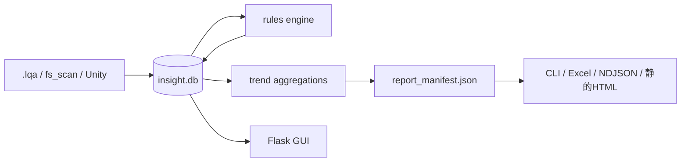

# AssetDataInsightSuite

ゲームアセットの品質を継続的に可視化するための単一パイプライン・単一データモデルのツール群。
設計の詳細は [AssetDataInsightSuite_DESIGN.md](AssetDataInsightSuite_DESIGN.md) を参照。

取り込み(`.lqa` / fs_scan / Unity asset)→ 不具合検知(YAML駆動ルール)→ トレンド集計 → 出力(CLI / Excel / NDJSON / 静的HTML / GUI)を、
`insight.db` (SQLite) 上の3テーブル (`scan_runs` / `asset_records` / `check_results`) + `defect_records` を唯一のソースオブトゥルースとして一貫実装している。



詳細な図解(全体アーキテクチャ・ERダイアグラム・シーケンス図)は技術解説書を参照:

- 📄 [docs/TECHNICAL_GUIDE.md](docs/TECHNICAL_GUIDE.md) — Markdown版(Mermaid記法、GitHub上でそのまま図が見える)
- 🌐 [docs/technical_guide.html](docs/technical_guide.html) — ブラウザで開けるスタンドアロンHTML版(オフライン)

## セットアップ

```bash
uv venv .venv
uv pip install -e ".[dev]" --python .venv
```

## 使い方

```bash
# 1. 取り込み(いずれか、または --producer all)
python -m ingest.run_scan --producer fs_scan --target <SCAN_TARGET_DIR> --db insight.db

# 2. 不具合検知(rules/definitions/*.yaml を読み込んで評価)
python -m rules.run_checks --target <SCAN_TARGET_DIR> --db insight.db

# 3-a. CIゲート用CLI(exit code: 0=defectなし / 1=warn以上 / 2=fail検出 or 実行時エラー)
python -m output.cli_adapter --db insight.db --fail-on warn --manifest-out report_manifest.json

# 3-b. Excelレポート
python -m output.excel_adapter --db insight.db --out report.xlsx

# 3-c. Elasticsearch _bulk 互換NDJSON
python -m output.ndjson_export --db insight.db --out checks.ndjson

# 3-d. オフライン静的HTMLレポート(Kibanaが無いチーム向けフォールバック)
python -m output.static_html_adapter --db insight.db --out-dir reports
```

CIでの定期実行は [.github/workflows/insight-scan.yml](.github/workflows/insight-scan.yml) を参照。

## 操作用GUI

上記CLIを1画面から操作できるローカルWebダッシュボード(Flask)。スキャン実行・履歴閲覧・Defect一覧・トレンドを提供する。
ローカル/単一ユーザー利用が前提で、認証機能は無い(既定で `127.0.0.1` のみ待受)。

```bash
python -m webapp.app --db insight.db --port 5000
```

起動後 `http://127.0.0.1:5000` を開く。

- **Dashboard** — producer/target pathを指定してスキャン実行(取り込み+ルールチェック)、スキャン履歴一覧
- **run詳細** — `report_manifest.json` の内容をそのまま表示。Excel/NDJSONダウンロード、静的HTMLレポート再生成もここから
- **Defects** — 検出中の`defect_records`一覧、severityで絞り込み
- **Trend** — scan_runごとの新規defect検出件数の推移

GUIは既存の `ingest` / `rules` / `output` モジュールを直接呼び出すだけで、独自の集計・判定ロジックは持たない。

## 動作確認手順

### 1. 自動テストで確認する(最も速い)

```bash
uv venv .venv
uv pip install -e ".[dev]" --python .venv
.venv/Scripts/python -m pytest -v
```

26件のpytestが全て通れば、取り込み・ルール検知・トレンド集計・CLI/Excel/NDJSON/静的HTML・GUIの主要パスは検証済み。

### 2. GUIを実際に触って確認する

リポジトリ同梱のフィクスチャ(`tests/fixtures/fs_scan_sample`)を使えば、外部データ無しですぐ試せる。

```bash
# 1) サーバー起動(insight.db はカレントディレクトリに新規作成される)
.venv/Scripts/python -m webapp.app --db insight.db --port 5000

# 2) ブラウザで http://127.0.0.1:5000 を開く
```

画面上での操作:

1. **Dashboard**の「スキャンを実行」フォームで
   - Producer: `fs_scan`
   - Target Path: リポジトリの絶対パス + `\tests\fixtures\fs_scan_sample`
   - 「取り込み後にルールチェックも実行する」にチェック
   - 「スキャン実行」をクリック → `/runs/1` のレポート画面に遷移し、命名規則違反・LOD未設定・未参照Materialなどのdefectが表示されることを確認
2. **Defects**タブでseverityフィルタ(fail/warn/info)が効くことを確認
3. run詳細画面の「Excelダウンロード」「NDJSONダウンロード」でファイルが落ちることを確認
4. **Trend**タブでscan_run別の新規defect件数が表示されることを確認(2回目以降のスキャンで変化を確認できる)
5. 終了は起動したターミナルで `Ctrl+C`

実際のUnity/アセットプロジェクトを対象にする場合は Target Path をそのプロジェクトのルートに変更するだけでよい
(`fs_scan` は拡張子ベースの汎用フォールバック、`.lqa`サイドカーがあれば `lqa`、Unity `.meta`があれば `unity_asset` を選択)。

### 3. CLIだけで一気通貫を確認する

```bash
.venv/Scripts/python -m ingest.run_scan --producer fs_scan --target tests/fixtures/fs_scan_sample --db insight.db
.venv/Scripts/python -m rules.run_checks --target tests/fixtures/fs_scan_sample --db insight.db
.venv/Scripts/python -m output.cli_adapter --db insight.db --fail-on warn --manifest-out report_manifest.json
echo "exit code: $?"   # 0=defectなし / 1=warn以上検出 / 2=fail検出 or 実行時エラー
.venv/Scripts/python -m output.excel_adapter --db insight.db --out report.xlsx
.venv/Scripts/python -m output.static_html_adapter --db insight.db --out-dir reports
```

`reports/1/index.html` をブラウザで開けば、GUIとは別経路(CI/オフライン向け)のRevolutトークンスタイルの静的レポートが確認できる。

## ディレクトリ構成

- `core/` — 正準スキーマ(`AssetRecord`/`CheckResult`)と SQLite 層
- `ingest/adapters/` — `.lqa` / fs_scan / Unity asset の各取り込みアダプタ(プラグイン登録方式)
- `rules/` — YAML駆動の不具合検知ルールエンジン
- `trend/` — トレンド集計関数(SQLのみ、描画とは分離)
- `output/` — `report_manifest.json` を唯一の中間形式とする CLI / Excel / NDJSON / 静的HTML 出力アダプタ
- `webapp/` — 操作用ローカルGUI(Flask)
- `tests/` — pytest スイートと固定フィクスチャ
- `docs/` — 技術解説書(Markdown + Mermaid / スタンドアロンHTML)

静的HTMLレポート(`output/static_html_adapter.py`)・GUI(`webapp/`)は `AssetDataInsightSuite_UI_DESIGN.md`(Revolutデザイン分析)のトークン
(2モードキャンバス・pill型バッジ・rounded-lg カード)に基づいてスタイリングされている。
