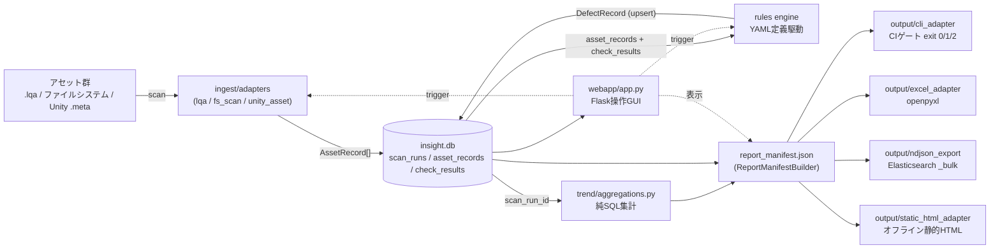
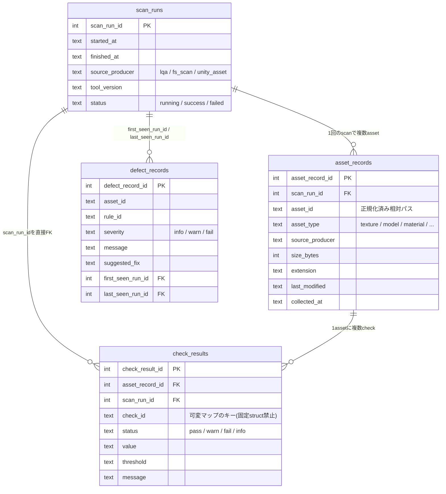
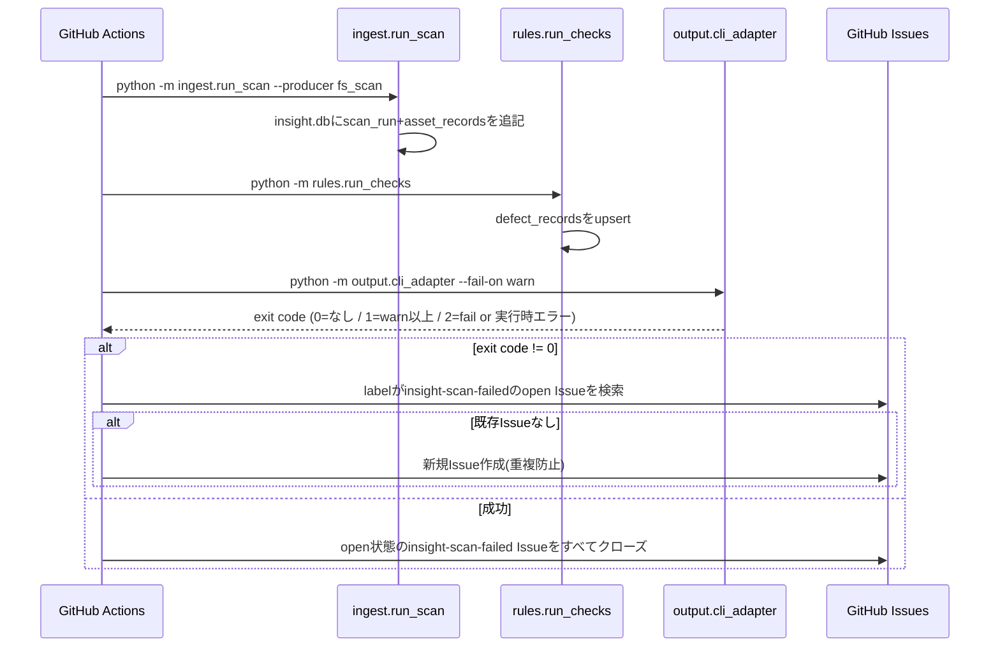
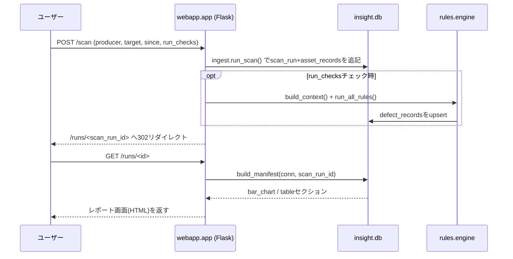

# AssetDataInsightSuite 技術解説書

本書はコードベースの実装を対象読者(保守・拡張を行うエンジニア)向けに解説する技術ドキュメントである。
要求仕様・フェーズ設計そのものは [`AssetDataInsightSuite_DESIGN.md`](../AssetDataInsightSuite_DESIGN.md) を、
静的レポート/GUIの見た目のトークン定義は [`AssetDataInsightSuite_UI_DESIGN.md`](../AssetDataInsightSuite_UI_DESIGN.md) を正とする。
本書はその上に立つ「実装がどう動くか」のリファレンスである。

## 目次

1. [全体アーキテクチャ](#全体アーキテクチャ)
2. [データモデル(insight.db)](#データモデルinsightdb)
3. [シーケンス: CI定期実行](#シーケンス-ci定期実行)
4. [シーケンス: GUIからのスキャン操作](#シーケンス-guiからのスキャン操作)
5. [モジュールリファレンス](#モジュールリファレンス)
6. [report_manifest.json スキーマ](#report_manifestjson-スキーマ)
7. [拡張ガイド](#拡張ガイド)
8. [テスト戦略](#テスト戦略)
9. [設計書フェーズとの対応表](#設計書フェーズとの対応表)

---

## 全体アーキテクチャ

`insight.db` (SQLite) を唯一の状態ストアとして、取り込み→検知→集計→出力の4段が
互いに疎結合な「`insight.db`の読み取りクライアント」として並ぶ。GUI (`webapp/`) は
既存のCLIモジュールを直接呼び出す薄いレイヤーであり、独自の集計・判定ロジックを持たない。



**設計原則(コードに落とし込まれているもの):**

- **単一パイプライン** — item3〜6(解析/不備検出/傾向確認/CI)は4つの別ツールではなく、この1本の流れの4断面。
- **`scan_runs`は追記専用** — 過去行のUPDATE/DELETEを一切行わない。`core/db.py`の`finish_scan_run`は`status`と`finished_at`のみ更新し、他の列は変更しない。
- **`report_manifest.json`の唯一のプロデューサー** — `output/report_manifest.py`の`ReportManifestBuilder`のみが書き込む。CLI/Excel/NDJSON/静的HTML/GUIはすべて`build_manifest()`が返すデータを読むだけ。
- **ルールはYAML駆動** — `rules/definitions/*.yaml`にrule_id・severity・閾値を定義し、Pythonコードにハードコードしない。
- **GUIはロジックを持たない** — `webapp/app.py`は`ingest.run_scan` / `rules.engine` / `output.*`を呼び出すだけの薄いレイヤー。

---

## データモデル(insight.db)

3テーブル(`scan_runs` / `asset_records` / `check_results`)がPhase 1の正準スキーマ、
`defect_records`がPhase 2のルール評価結果を保持する。全テーブルが`scan_run_id`を直接持つため、
Phase 3のトレンド集計は`asset_records`とのJOINなしに`GROUP BY scan_run_id`だけで書ける。



`defect_records`は`(asset_id, rule_id)`にUNIQUE制約を持ち、`core/db.py`の`upsert_defect_record()`が
「既存なら`last_seen_run_id`のみ更新、新規なら`first_seen_run_id == last_seen_run_id == 今回のscan_run_id`」
という上書きロジックを担う。これがPhase 3の「いつから壊れているか」トレンドの供給元になる。

---

## シーケンス: CI定期実行

`.github/workflows/insight-scan.yml`が`schedule`(cron)と`workflow_dispatch`(手動)の両方で起動する。



---

## シーケンス: GUIからのスキャン操作

GUIはCLIと同じ関数を直接呼ぶだけで、判定ロジックの複製は一切ない。



---

## モジュールリファレンス

| モジュール | 役割 | 拡張ポイント |
|---|---|---|
| `core/schema.py` | 正準スキーマ `AssetRecord` / `CheckResult`(`checks`は可変dict) | 新しい固定フィールドは追加しない。個別の値は`checks`マップに載せる |
| `core/db.py` | SQLite DDL + 追記専用の挿入/更新ヘルパー | 新テーブルは基本的に不要(Phase 3の設計原則) |
| `ingest/adapters/registry.py` | `SourceAdapter` Protocol + `ADAPTER_REGISTRY` + `@register`デコレータ | 新規プロデューサーは`ingest/adapters/`に1ファイル追加するだけで登録される |
| `ingest/adapters/{lqa,fs_scan,unity_asset}_adapter.py` | 各プロデューサー固有のパース処理 | — |
| `ingest/run_scan.py` | CLIエントリポイント。アダプタをインポートして`ADAPTER_REGISTRY`に登録させ、`scan_run`を発行 | — |
| `rules/engine.py` | `rules/definitions/*.yaml`を読み込み、`module`が指すモジュールの`evaluate()`を呼ぶ | ルール追加はYAML定義+`evaluate(context, rule_def)`関数のみ |
| `rules/naming_convention.py` | regexベースの命名/コーディング規則違反検知(同一モジュールを両方の用途に再利用) | — |
| `rules/lod_missing.py` | `lod_group_configured`チェックのpass/fail判定 | — |
| `rules/unused_material.py` | `.unity`/`.prefab`をスキャンして参照グラフを構築し、Materialの被参照有無を判定 | — |
| `rules/orphan_and_individual_fix.py` | `overrides:`リストの個別修正指摘 + 汎用孤立アセット検知 | — |
| `rules/run_checks.py` | CLIエントリポイント。`RuleContext`構築→全ルール実行→`defect_records`upsert | — |
| `trend/aggregations.py` | 純SQL集計関数群(ヒストグラム/カバレッジ/外れ値/分布) | 新しい集計軸を増やすときはここに関数を1つ追加するだけ |
| `trend/charts.py` | 集計結果を受け取って描画するだけ(SQLを直接叩かない) | — |
| `output/report_manifest.py` | `ReportManifestBuilder`(唯一のmanifestプロデューサー)+ `build_manifest()` | 新しいセクションは`build_manifest()`に`add_section()`を1行追加するだけ |
| `output/cli_adapter.py` | CIゲートCLI。severityからexit codeを算出 | — |
| `output/excel_adapter.py` | manifestセクションをそのままシート/チャートへ転記するだけ | — |
| `output/ndjson_export.py` | Elasticsearch `_bulk`互換NDJSONエクスポート | — |
| `output/static_html_adapter.py` | オフライン静的HTML生成。`AssetDataInsightSuite_UI_DESIGN.md`のRevolutトークンでスタイリング | — |
| `webapp/app.py` | Flask操作GUI。ingest/rules/outputを直接呼ぶだけの薄いレイヤー | 新しい画面はルート追加+テンプレート追加 |

---

## report_manifest.json スキーマ

`ReportManifestBuilder`が唯一の書き込み口であり、CLI/Excel/静的HTML/GUIはすべてこの形を読むだけ。

```json
{
  "manifest_version": "1.0",
  "scan_run_id": 42,
  "generated_at": "2026-08-11T09:00:00Z",
  "sections": [
    {
      "section_id": "texture_resolution_histogram",
      "type": "bar_chart",
      "title": "テクスチャ解像度分布",
      "data": { "labels": ["256", "512", "1024", "2048", "4096", "4096+"], "values": [12, 48, 120, 30, 4, 0] }
    },
    {
      "section_id": "defect_summary",
      "type": "table",
      "title": "不具合一覧(severity>=warn)",
      "data": {
        "columns": ["asset_id", "rule_id", "severity", "first_seen_run_id"],
        "rows": [["Assets/Textures/rock_d.png", "naming_convention", "warn", 39]]
      }
    }
  ]
}
```

現在`build_manifest()`が生成するセクションは6つ: `texture_resolution_histogram` / `lod_fade_coverage` /
`size_distribution` / `extension_breakdown` / `last_modified_distribution`(いずれも`bar_chart`)、
`defect_summary`(`table`)。

---

## 拡張ガイド

### 新しい取り込みプロデューサーを追加する

1. `ingest/adapters/<name>_adapter.py` を作成し、`producer_id`属性と`scan(target_path, since)`メソッドを持つクラスを`@register`で登録する。
2. `ingest/run_scan.py`はこのファイルを直接importしていないため、`main()`内の`from ingest.adapters import ...`行に追記が必要(またはテストファイル側で個別import)。
3. 既存コード(`core/db.py`, `rules/`, `trend/`, `output/`)は一切変更不要。

### 新しい検知ルールを追加する

1. `rules/definitions/<rule_id>.yaml`を作成(`rule_id` / `module` / `applies_to` / `severity` / `params`)。
2. `module`が指す既存モジュール(`naming_convention.py`など)を再利用するか、`evaluate(context: RuleContext, rule_def: dict) -> list[DefectRecord]`を実装する新規モジュールを作る。
3. `rules/engine.py`・`rules/run_checks.py`は変更不要(`DEFINITIONS_DIR`配下を自動で読み込む)。

### 新しい集計軸を追加する

1. `trend/aggregations.py`に純SQL関数を1つ追加する(DB接続以外の外部依存を持たせない)。
2. `output/report_manifest.py`の`build_manifest()`に`builder.add_section(...)`を1行追加する。
3. CLI/Excel/静的HTML/GUIは`report_manifest`のセクション配列をループしているだけなので自動的に反映される。

### GUIに新しい画面を追加する

1. `webapp/app.py`に`@app.route(...)`を追加し、既存の`core.db` / `rules.engine` / `output.*`を呼ぶだけの薄いハンドラを書く。
2. `webapp/templates/`にテンプレートを追加し、`webapp/templates/base.html`を継承する。
3. `webapp/static/style.css`のRevolutトークン(`--primary` / `--radius-lg` / `--radius-full`など)を再利用する。

---

## テスト戦略

```
tests/
  conftest.py              # fixtures_dir / lqa_sample_dir / fs_scan_sample_dir / db_path
  fixtures/
    lqa_sample/             # .lqa.json 固定フィクスチャ(未知checkId・conversion_errors含む)
    fs_scan_sample/         # fs_scan固定フィクスチャ(命名規則違反・LOD未設定・未参照Material込み)
  test_ingest.py            # アダプタのAssetRecord正規化・冪等性・レジストリ
  test_rules.py             # YAML駆動・命名規則・unused_material・individual override・upsert
  test_trend.py             # z-score/IQR外れ値・純粋性(同一入力で同一結果)
  test_output.py            # CLI exit code・CLI/Excelの値一致・NDJSON形式・静的HTMLのオフライン性
  test_webapp.py            # ダッシュボード/スキャン実行/Defect絞り込み/Excel・NDJSONダウンロード/404
```

実行方法:

```bash
python -m pytest -v
```

各フェーズの検証チェックリスト(`AssetDataInsightSuite_DESIGN.md`内)は上記テストが1対1に近い形でカバーしている
(冪等性・未知checkId耐性・first_seen/last_seen upsertセマンティクス・CLI/Excelの値一致・NDJSON `_bulk`形式など)。

---

## 設計書フェーズとの対応表

| Phase | 内容 | 実装場所 |
|---|---|---|
| Phase 0 | コンセプト・入力契約・正準スキーマ | `core/schema.py` |
| Phase 1 | 正規化取り込み層 | `core/db.py`, `ingest/` |
| Phase 2 | 不具合検知モジュール | `rules/` |
| Phase 3 | トレンド分析モジュール | `trend/` |
| Phase 4 | 出力アダプタ層(CLI/Excel/統一フォーマット) | `output/report_manifest.py`, `output/cli_adapter.py`, `output/excel_adapter.py` |
| Phase 5 | CI定期実行+Kibana連携+静的HTML | `.github/workflows/insight-scan.yml`, `output/ndjson_export.py`, `output/static_html_adapter.py` |
| (追加) | 操作用GUI | `webapp/` |
